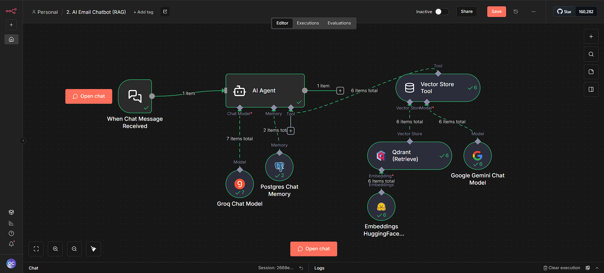
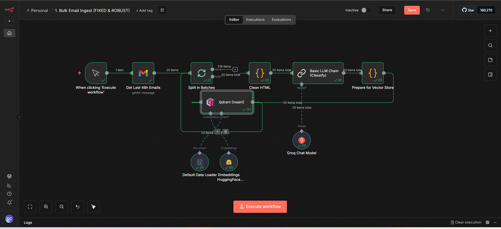

AI Email Auto Analyst (n8n + Qdrant + Postgres)

This project ingests incoming emails, auto-analyzes them (summarize, classify, extract tasks), stores embeddings in a vector database for semantic search, and exposes a RAG chat endpoint for natural-language queries. It runs locally via Docker and uses n8n for orchestration, Qdrant for vectors, OpenAI/Hugging Face for LLMs and embeddings, and Postgres for chat memory.

Designed for practicality and demoability: Gmail-based workflows handle real inboxes, classification creates actionable tags, and the RAG chatbot answers questions like “Show me urgent supplier emails this week” grounded by retrieved email context. The stack is minimal, easy to run, and extendable.

Key Features
- Auto-tagging and summarization of incoming emails
- Vectorized storage for fast semantic search (Qdrant)
- RAG chatbot with Postgres-backed chat memory
- Gmail-first ingestion using native n8n nodes

Workflows (Screenshots)
- RAG Chatbot (after run)

	

- Email Gather → Vector DB (after run)

	

Demo (GIF)
- End-to-end demo of ingest, classify, embed, and chat:

	

Credentials Required
- OpenAI: `OPENAI_API_KEY` for chat and embeddings (or use Hugging Face for embeddings, `HF_API_TOKEN`).
- Gmail: App Password for SMTP send, or Gmail OAuth credentials for the Gmail nodes.
- Qdrant: Local Docker service; default has no auth. Set `QDRANT_URL` when using HTTP nodes.
- Postgres (Chat Memory): Host `postgres` (from Docker network), Port `5432`, DB `Email_ai`, User `postgres`, Password `tisha` (or your values in `.env`).

Used Models
- Chat: OpenAI `gpt-4o-mini` (configurable in n8n).
- Embeddings: OpenAI `text-embedding-3-small` (1536 dims) or Hugging Face `all-MiniLM-L6-v2` (384 dims) depending on workflow variant.

Run (Docker)
- See `docs/run-guide.md` for precise Windows PowerShell commands.
- Quick start:

	1) Copy `.env.example` to `.env` and fill values (OpenAI, Gmail, Qdrant, Postgres).
	2) Start services: `docker compose up -d`
	3) Open n8n at `http://localhost:5678/`.
	4) Import workflows from the `workflows/` folder.
	5) Bind credentials in n8n (OpenAI, Gmail, Postgres, Qdrant) and activate.

Repository Structure
- `workflows/`: n8n JSON workflows (Gmail ingest, RAG chatbot, official AI nodes variant).
- `assets/`: Screenshots and demo (`RAG.png`, `GATHER_VECTOR_DB.png`, `email_ai_analyst.gif`).
- `docs/`: Architecture and run guide.
- `docker-compose.yml`: n8n, Qdrant, Postgres services.
- `.env`: Environment variables for local run.

Notes
- If using Hugging Face embeddings (384 dims), create the Qdrant collection accordingly. For OpenAI embeddings (1536 dims), use a separate collection or recreate with the correct vector size.
- Inside Docker, use `postgres` as the hostname for the Postgres Chat Memory node.