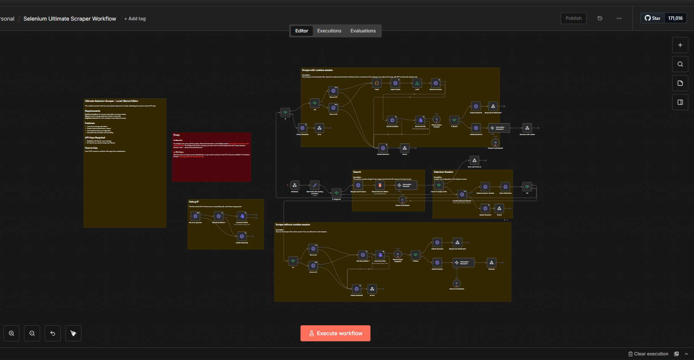
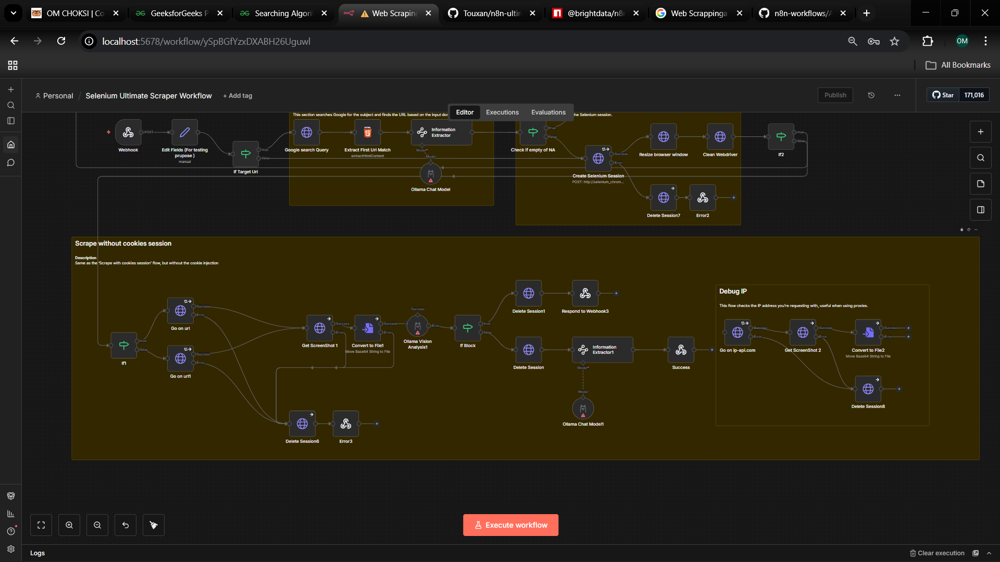
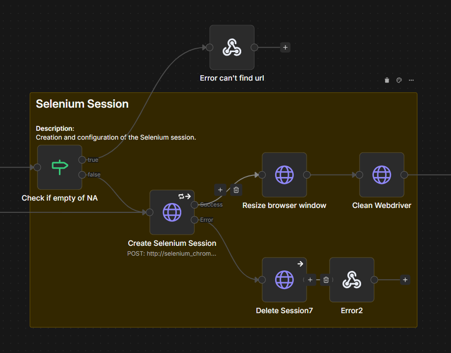
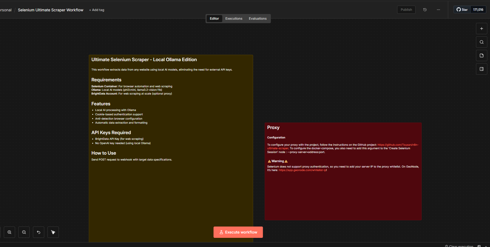

# AI-Powered Ultimate Web Scraper

This advanced web scraping solution combines the power of Selenium browser automation with local AI models through Ollama, creating a sophisticated data extraction system that can intelligently analyze and extract information from any website. The workflow leverages computer vision and natural language processing to understand web content and extract structured data based on your specific requirements.

Built for scalability and privacy, this system eliminates the need for expensive external API services by running everything locally. Whether you're collecting product data, monitoring competitor information, or gathering research data, this scraper adapts to your needs with intelligent content analysis and anti-detection measures that help bypass common scraping restrictions.

The system is designed for both technical and non-technical users, offering a simple webhook interface for data extraction requests while providing the flexibility to handle complex scenarios like authentication, JavaScript-heavy sites, and dynamic content loading.

## Workflow Screenshots

### Complete Workflow Overview

*Full view of the AI Dataset Creator workflow showing all nodes and connections*

### Workflow Architecture

*Detailed view of the workflow architecture and node relationships*

### Selenium Session Management

*Selenium browser automation and session management configuration*

### Documentation Interface

*n8n documentation and configuration interface*

## Features

- **Local AI Processing**: Uses Ollama models (phi3:mini, llama3.2-vision) for intelligent content analysis
- **Advanced Web Scraping**: Selenium-based automation with anti-detection capabilities
- **Authentication Support**: Cookie-based login and session management
- **Dynamic Content Handling**: JavaScript execution and AJAX content loading
- **Anti-Detection**: Browser fingerprint masking and human-like behavior simulation
- **Flexible Data Extraction**: Custom data field specification with intelligent content matching
- **Structured Output**: JSON-formatted results ready for further processing
- **Proxy Support**: Built-in proxy integration for large-scale scraping
- **Visual Analysis**: Screenshot-based content analysis for complex layouts
- **Real-time Processing**: Instant webhook responses with live data extraction

## What You Can Do

### Data Collection Scenarios
- **E-commerce Intelligence**: Product prices, reviews, inventory levels, competitor analysis
- **Social Media Monitoring**: Follower counts, engagement metrics, trending content
- **Financial Data**: Stock prices, market trends, company information
- **News & Content**: Article extraction, sentiment analysis, topic monitoring
- **Lead Generation**: Contact information, business directories, professional profiles
- **Research & Analytics**: Academic data, statistical information, survey results

### Technical Capabilities
- Extract data from JavaScript-heavy single-page applications
- Handle complex authentication flows and protected content
- Process multiple data points simultaneously with high accuracy
- Scale from single requests to bulk data collection operations
- Integrate with existing workflows through webhook API
- Export data in multiple formats (JSON, CSV, structured datasets)

## Quick Start

### Prerequisites
- Docker and Docker Compose installed
- 8GB+ RAM (for AI models)
- Stable internet connection

### Installation & Setup

1. **Clone and Navigate**
   ```bash
   git clone <your-repo>
   cd AI-AUTOMATION-WORKFLOWS
   ```

2. **Start Services**
   ```bash
   docker-compose up -d
   ```

3. **Download AI Models** (one-time setup)
   ```bash
   # Wait for Ollama to start, then pull models
   docker exec ai-automation-workflows-ollama-1 ollama pull phi3:mini
   docker exec ai-automation-workflows-ollama-1 ollama pull llama3.2-vision:11b
   ```

4. **Import Workflow**
   - Open n8n at `http://localhost:5678`
   - Import the workflow JSON file
   - Activate the workflow

### Usage Example

Send a POST request to extract data:

```bash
curl -X POST http://localhost:5678/webhook-test/67d77918-2d5b-48c1-ae73-2004b32125f0 \
-H "Content-Type: application/json" \
-d '{
  "subject": "GitHub Repository Stats",
  "Url": "github.com",
  "Target data": [
    {
      "DataName": "Stars",
      "description": "Total number of stars on the repository"
    },
    {
      "DataName": "Forks",
      "description": "Number of repository forks"
    }
  ]
}'
```

## Configuration

### Required API Keys
- **BrightData API Key**: For web scraping service (sign up at BrightData)
- **No OpenAI/External AI API needed**: Uses local Ollama models

### Service Endpoints
- **n8n Dashboard**: `http://localhost:5678`
- **Selenium Grid**: `http://localhost:4444`
- **Selenium VNC** (debug): `http://localhost:7900`
- **Ollama API**: `http://localhost:11434`

### Workflow Configuration
1. **Add BrightData Credentials** in n8n credential manager
2. **Configure Target Domains** in the workflow settings
3. **Customize Data Extraction Fields** based on your needs
4. **Set Proxy Settings** (optional) for large-scale operations

## Step-by-Step Workflow Execution

### 1. Input Processing
The workflow receives your extraction request and processes the target URL and data requirements.

### 2. Search & Discovery
Performs intelligent Google search to find relevant pages on the target domain.

### 3. Browser Session Creation
Launches a Selenium-controlled Chrome browser with anti-detection measures.

### 4. Content Loading
Navigates to the target page, handles JavaScript loading, and captures screenshots.

### 5. AI Analysis
Uses Ollama vision models to analyze page content and extract relevant information.

### 6. Data Extraction
Applies intelligent parsing to structure the extracted data according to your specifications.

### 7. Response Generation
Returns formatted JSON data ready for integration into your systems.

## Troubleshooting

### Common Issues
- **Workflow not responding**: Check if all Docker containers are running
- **AI models not found**: Ensure Ollama models are properly downloaded
- **Selenium errors**: Verify Selenium container has sufficient resources
- **Rate limiting**: Configure proxy settings or adjust request timing

### Debug Tools
- Use VNC viewer on port 7900 to watch browser automation
- Check n8n execution logs for detailed error information
- Monitor container logs: `docker-compose logs -f`

## 📚 Advanced Usage

For complex scraping scenarios, modify the workflow to include custom JavaScript execution, handle multiple authentication methods, or process batch requests. The modular design allows for easy customization and extension.

## 🤝 Contributing

Feel free to submit issues, feature requests, or improvements to make this scraping solution even more powerful and user-friendly.

## License

This project is open source and available under the [MIT License](LICENSE).