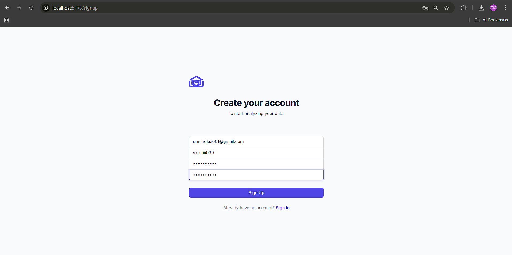
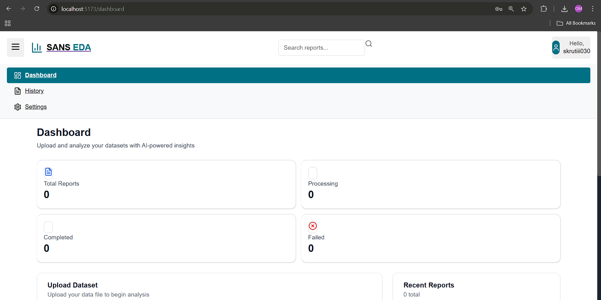
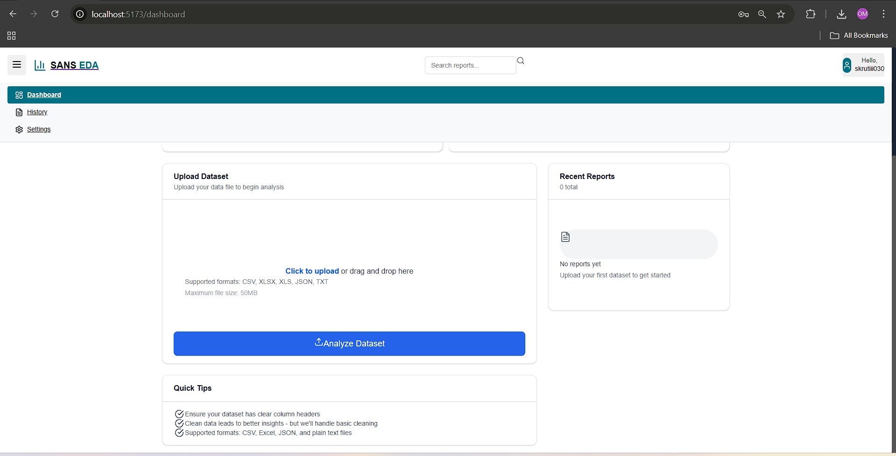
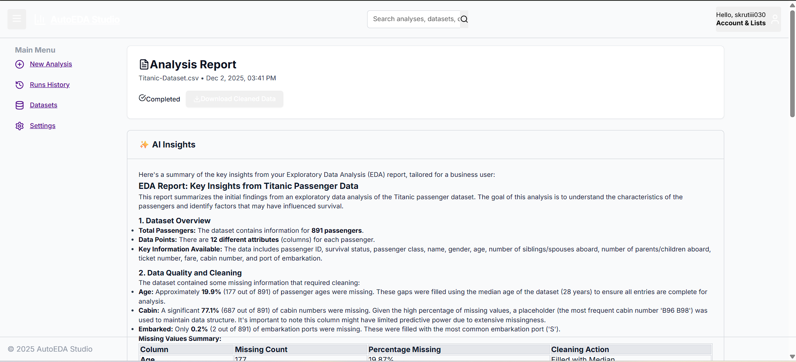
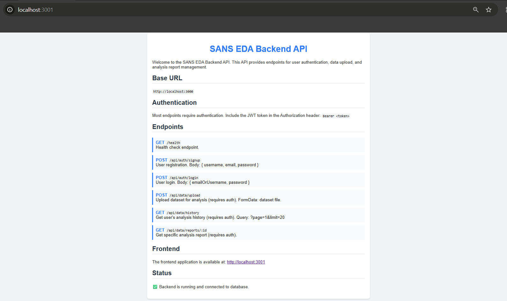
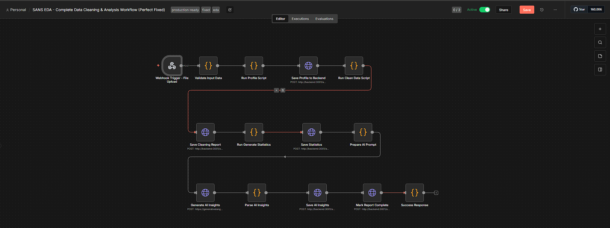
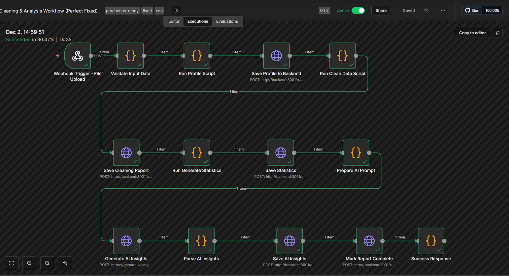

# Data Cleaning and Analysis Workflow Platform

## Overview

This platform provides an automated end-to-end solution for exploratory data analysis (EDA) and data cleaning workflows. Built with a modern microservices architecture, the system leverages Docker containerization to orchestrate multiple services including a React-based frontend, Node.js backend API, PostgreSQL database, and n8n workflow automation engine. The platform intelligently processes various data formats (CSV, Excel, JSON, Parquet) with support for multiple encodings and delimiters, automatically generating comprehensive statistical analyses, visualizations, and AI-powered insights.

## Architecture

The application implements a robust three-tier architecture where the frontend communicates with the backend REST API, which in turn coordinates with the database for persistence and n8n for workflow orchestration. Python scripts handle the computationally intensive data analysis tasks, generating correlation matrices, distribution plots, categorical analyses, and clustering visualizations. The system supports concurrent user sessions through JWT-based authentication, maintains analysis history, and provides downloadable cleaned datasets along with professionally formatted PDF reports of the analysis results.

## Features

The platform offers comprehensive data analysis capabilities including automatic detection of data types, handling of missing values with intelligent imputation strategies, and generation of descriptive statistics. Users benefit from AI-generated insights that summarize key findings, multiple visualization types including correlation heatmaps and distribution plots, and the ability to download both cleaned datasets and formatted PDF reports. The responsive web interface provides real-time analysis status updates, a history of previous analyses, and support for batch processing of multiple datasets.

## Screenshots

### User Authentication


### Dashboard


### Data Upload Interface


### Analysis Results


### Backend API Endpoints


### n8n Workflow Configuration


### Workflow Execution


## Technology Stack

### Frontend
- React 18 with Vite
- TailwindCSS for styling
- Axios for API communication
- React Router for navigation
- React Hot Toast for notifications

### Backend
- Node.js 18 with Express
- PostgreSQL 15 for data persistence
- JWT for authentication
- Multer for file uploads
- Puppeteer for PDF generation

### Data Analysis
- Python 3 with pandas, numpy
- Matplotlib and Seaborn for visualizations
- Scikit-learn for clustering analysis

### Orchestration
- n8n workflow automation
- Docker and Docker Compose
- Nginx (optional reverse proxy)

## Prerequisites

- Docker Desktop (Windows/Mac) or Docker Engine (Linux)
- Docker Compose v2.0 or higher
- Git for version control
- Minimum 4GB RAM allocated to Docker
- 10GB free disk space

## Installation and Setup

### 1. Clone the Repository

```bash
git clone https://github.com/OMCHOKSI108/AI-AUTOMATION-WORKFLOWS.git
cd AI-AUTOMATION-WORKFLOWS/DATA_CLEANING_WORKFLOW
```

### 2. Environment Configuration

Create a `.env` file in the project root:

```env
# Database Configuration
POSTGRES_USER=postgres
POSTGRES_PASSWORD=your_secure_password
POSTGRES_DB=sans_eda_db
DATABASE_URL=postgresql://postgres:your_secure_password@db:5432/sans_eda_db

# Backend Configuration
PORT=3001
JWT_SECRET=your_jwt_secret_key_here
NODE_ENV=production

# n8n Configuration
N8N_WEBHOOK_URL=http://n8n:5678/webhook/eda-analysis
GEMINI_API_KEY=your_gemini_api_key_optional

# Frontend Configuration
VITE_API_URL=http://localhost:3001
```

### 3. Build and Run with Docker Compose

Build all services:

```bash
docker-compose build
```

Start all containers:

```bash
docker-compose up -d
```

Verify all services are running:

```bash
docker-compose ps
```

Check service health:

```bash
docker-compose logs -f
```

### 4. Database Initialization

The database schema is automatically created on first run. To manually initialize:

```bash
docker exec -it data_cleaning_workflow-backend-1 npm run setup-db
```

### 5. Access the Application

- **Frontend:** http://localhost:5173
- **Backend API:** http://localhost:3001
- **n8n Workflow UI:** http://localhost:5678
- **PostgreSQL:** localhost:5435

### 6. Import n8n Workflow

1. Access n8n at http://localhost:5678
2. Navigate to Workflows
3. Import the workflow from `EDA.json`
4. Configure the webhook URL in the workflow settings
5. Activate the workflow

## Docker Commands Reference

### Container Management

Start all services:
```bash
docker-compose up -d
```

Stop all services:
```bash
docker-compose down
```

Restart specific service:
```bash
docker-compose restart backend
docker-compose restart frontend
docker-compose restart n8n
```

Rebuild after code changes:
```bash
docker-compose up --build -d
```

### Monitoring and Debugging

View logs for all services:
```bash
docker-compose logs -f
```

View logs for specific service:
```bash
docker-compose logs -f backend
docker-compose logs -f frontend
docker-compose logs -f db
docker-compose logs -f n8n
```

Access container shell:
```bash
docker exec -it data_cleaning_workflow-backend-1 sh
docker exec -it data_cleaning_workflow-frontend-1 sh
```

Check container resource usage:
```bash
docker stats
```

### Data Management

Backup database:
```bash
docker exec data_cleaning_workflow-db-1 pg_dump -U postgres sans_eda_db > backup.sql
```

Restore database:
```bash
docker exec -i data_cleaning_workflow-db-1 psql -U postgres sans_eda_db < backup.sql
```

Clean up volumes (caution: deletes data):
```bash
docker-compose down -v
```

### Troubleshooting

Remove all containers and rebuild:
```bash
docker-compose down
docker-compose rm -f
docker-compose build --no-cache
docker-compose up -d
```

Check container health:
```bash
docker inspect data_cleaning_workflow-backend-1 | grep -A 10 Health
```

Network diagnostics:
```bash
docker network inspect data_cleaning_workflow_default
```

## API Documentation

### Authentication Endpoints

**POST** `/api/auth/signup`
- Register new user account
- Body: `{ username, email, password }`

**POST** `/api/auth/login`
- Authenticate user and receive JWT token
- Body: `{ email, password }`

### Data Analysis Endpoints

**POST** `/api/data/upload`
- Upload dataset for analysis
- Headers: `Authorization: Bearer <token>`
- Body: FormData with file

**GET** `/api/data/history?page=1&limit=20`
- Retrieve user's analysis history
- Headers: `Authorization: Bearer <token>`

**GET** `/api/data/reports/:reportId`
- Get detailed analysis report
- Headers: `Authorization: Bearer <token>`

**GET** `/api/data/download/:reportId`
- Download cleaned dataset
- Headers: `Authorization: Bearer <token>`

**GET** `/api/data/download-pdf/:reportId`
- Download PDF report
- Headers: `Authorization: Bearer <token>`

### User Management Endpoints

**GET** `/api/users/profile`
- Retrieve user profile information
- Headers: `Authorization: Bearer <token>`

**PUT** `/api/users/preferences`
- Update user preferences
- Headers: `Authorization: Bearer <token>`

## Development Workflow

### Running in Development Mode

Frontend development server:
```bash
cd frontend
npm install
npm run dev
```

Backend development server:
```bash
cd backend
npm install
npm run dev
```

### Code Structure

```
DATA_CLEANING_WORKFLOW/
├── backend/
│   ├── config/          # Database configuration
│   ├── middleware/      # Authentication and error handling
│   ├── routes/          # API route handlers
│   ├── scripts/         # Python analysis scripts
│   └── uploads/         # Temporary file storage
├── frontend/
│   ├── src/
│   │   ├── components/  # React components
│   │   ├── contexts/    # React context providers
│   │   ├── services/    # API service layer
│   │   └── utils/       # Helper functions
│   └── public/          # Static assets
├── n8n/
│   └── Dockerfile       # n8n container configuration
├── docs/                # Project documentation
├── assets/              # Screenshots and media
└── docker-compose.yml   # Service orchestration
```

## Data Analysis Pipeline

1. **File Upload:** User uploads dataset through the frontend interface
2. **Validation:** Backend validates file type, size, and format
3. **Storage:** File is saved to the uploads directory with unique identifier
4. **Workflow Trigger:** n8n webhook is invoked with file metadata
5. **Analysis Execution:** Python scripts perform:
   - Data type inference and validation
   - Missing value detection and imputation
   - Statistical analysis (mean, median, std, quartiles)
   - Correlation matrix computation
   - Distribution analysis
   - Categorical value analysis
   - K-means clustering (when applicable)
6. **Visualization Generation:** Creates base64-encoded plots
7. **AI Insights:** Generates natural language summary of findings
8. **Report Storage:** Results are persisted to PostgreSQL
9. **Notification:** Frontend polls for completion and displays results

## Security Considerations

- JWT tokens expire after 24 hours
- Passwords are hashed using bcrypt with salt rounds
- File uploads are validated for type and size
- SQL injection protection through parameterized queries
- CORS configured for specific origins only
- Environment variables for sensitive configuration
- Container isolation through Docker networking
- Database credentials not exposed to frontend

## Performance Optimization

- Frontend build optimization with Vite
- React code splitting for faster load times
- Database indexing on frequently queried columns
- Connection pooling for PostgreSQL
- Caching of analysis results
- Asynchronous processing through n8n
- Puppeteer runs in headless mode for PDF generation
- Image optimization in base64 encoding

## Troubleshooting Guide

### Container fails to start
- Check Docker Desktop is running
- Verify port availability (5173, 3001, 5432, 5678)
- Review logs: `docker-compose logs <service-name>`

### Database connection errors
- Ensure PostgreSQL container is healthy
- Verify DATABASE_URL in .env file
- Check network connectivity between containers

### n8n workflow not triggering
- Verify webhook URL configuration
- Check n8n container logs
- Ensure workflow is activated in n8n UI

### PDF generation fails
- Confirm Chromium installation in backend container
- Check available memory (minimum 2GB for Puppeteer)
- Review backend logs for specific error messages

### Frontend not connecting to backend
- Verify VITE_API_URL environment variable
- Check CORS configuration in backend
- Ensure backend container is running and healthy

## Contributing

This is a private project. For access or contribution inquiries, contact the repository owner.

## License

This project is proprietary software. All rights reserved.

## Support

For technical support or questions regarding deployment, please open an issue in the GitHub repository or contact the development team.

## Roadmap

### Planned Features
- Support for real-time streaming data analysis
- Integration with cloud storage providers (AWS S3, Google Cloud Storage)
- Advanced machine learning model training capabilities
- Collaborative workspace for team analysis
- Automated anomaly detection
- Support for time-series analysis
- Export to multiple formats (Excel, CSV, JSON)
- API rate limiting and usage analytics
- Multi-language support for UI
- Advanced user permissions and role management

### Technical Improvements
- Kubernetes deployment configuration
- Horizontal scaling for backend services
- Redis caching layer
- GraphQL API option
- WebSocket support for real-time updates
- Comprehensive unit and integration tests
- CI/CD pipeline with GitHub Actions
- Performance monitoring and alerting
- Automated backup and disaster recovery

## Acknowledgments

Built with modern web technologies and best practices for containerized applications. Special thanks to the open-source community for the excellent tools and libraries that made this project possible.
