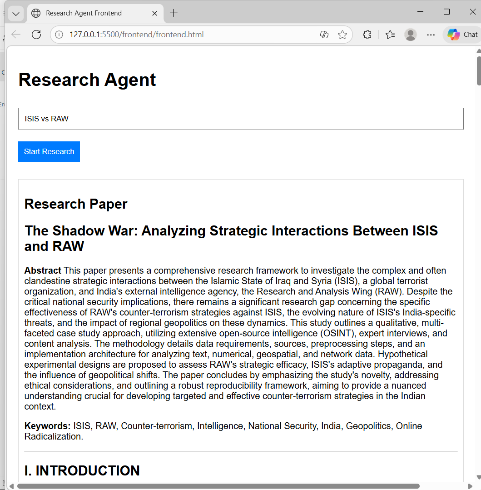
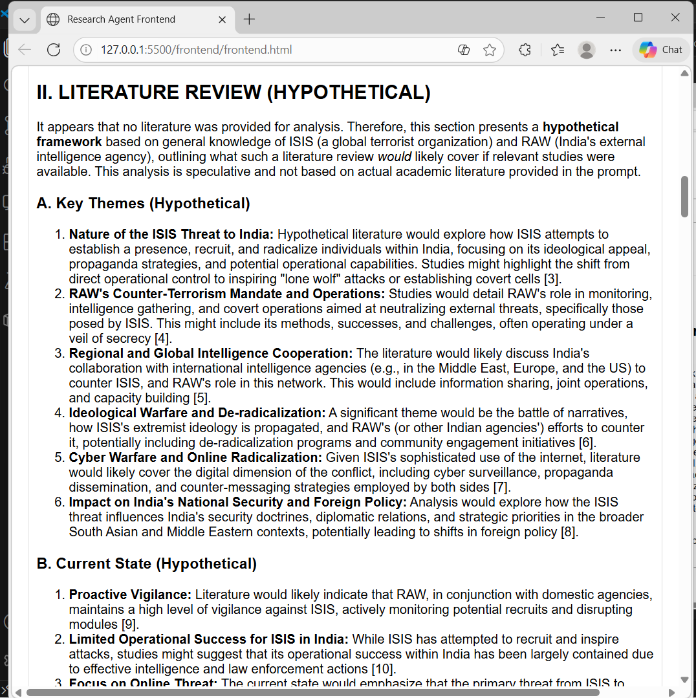
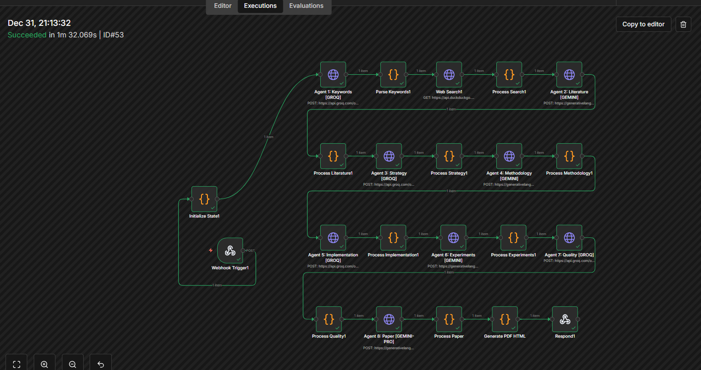

# Multi-Agent Research System (n8n)

> Version 8.0 - Production-Ready, Single Unified Workflow

An advanced, autonomous multi-agent research system powered by n8n orchestration. 8 specialized AI agents collaborate to transform a research topic into a comprehensive academic paper.


---

## Screenshots

### Frontend Interface


### Research Results


### n8n Workflow


---

### 8 Specialized Agents
| Agent | Role | Model |
|-------|------|-------|
| Orchestrator | State initialization & management | Code Node |
| Keyword Generator | Academic search keyword generation | LLaMA 3.3-70B |
| Researcher | Literature search & discovery | HTTP/API |
| Strategist | Gap identification & strategy | LLaMA 3.3-70B |
| Architect | Methodology design | LLaMA 3.3-70B |
| Implementer | Data & implementation planning | LLaMA 3.3-70B |
| Analyst | Experiment design | LLaMA 3.3-70B |
| Editor | Final paper compilation | LLaMA 3.3-70B |

### Premium Frontend
- Modern glassmorphism design
- Real-time agent progress visualization
- Markdown rendering with syntax highlighting
- Copy & download functionality
- Responsive design

---

## Architecture

```
┌──────────────────────────────────────────────────────────────────────────────┐
│                              FRONTEND (index.html)                           │
│                                                                              │
│   ┌───────────────────────────────┐                                          │
│   │   Submit Research Topic Form  │                                          │
│   └───────────────┬───────────────┘                                          │
└───────────────────┼──────────────────────────────────────────────────────────┘
          │  POST /webhook/start-research
          ▼
┌──────────────────────────────────────────────────────────────────────────────┐
│                              n8n WORKFLOW (v8)                               │
│                                                                              │
│  ┌────────────┐   ┌────────────┐   ┌────────────┐   ┌────────────┐           │
│  │  Webhook   │─▶│  Init State│─▶│ Agent 1:    │─▶│ Agent 2:    │          │
│  │  Trigger   │   │           │   │ Keywords   │   │ Research   │            │
│  └────────────┘   └────────────┘   └────────────┘   └────────────┘           |
│                                                                              │
│      ──▶ Agent 3: Literature Review                                         │
│      ──▶ Agent 4: Strategy                                                  │
│      ──▶ Agent 5: Methodology                                               │
│      ──▶ Agent 6: Implementation                                            │
│      ──▶ Agent 7: Experiment Design                                         │
│      ──▶ Agent 8: Editor                                                    │
│      ──▶ Compile Output                                                     │
│      ──▶ Respond                                                            │
└──────────────────────────────────────────────────────────────────────────────┘
          │
          ▼
┌──────────────────────────────────────────────────────────────────────────────┐
│                              RESPONSE (JSON)                                 │
│  {                                                                           │
│    "success": true,                                                          │
│    "content": "# Research Paper...",                                         │
│    "metadata": { "executionTimeSeconds": 45, "agentsExecuted": 8 }           │
│  }                                                                           │
└──────────────────────────────────────────────────────────────────────────────┘
```
```


## Agent Pipeline

### Phase 1: Initialization
- Webhook Trigger → Receives topic from frontend
- Initialize State → Creates research state object with artifacts container

### Phase 2: Research Intelligence (Agent 1-3)
- Keyword Generator → Generates primary/secondary keywords, synonyms
- Web Search → Searches DuckDuckGo for academic literature
- Literature Reviewer → Analyzes search results, identifies themes

### Phase 3: Strategy & Methodology (Agent 4-5)
- Research Strategist → Formulates gap statement, problem, RQs, objectives
- Methodology Architect → Designs research methodology, tools, validation

### Phase 4: Implementation & Experiments (Agent 6-7)
- Implementation Designer → Plans data requirements, preprocessing, code
- Experiment Designer → Creates experimental framework, metrics, tests

### Phase 5: Quality & Compilation (Agent 7-8)
- Quality Reviewer → Validates novelty, ethics, reproducibility
- Paper Compiler → Generates complete IEEE-format research paper

### Phase 6: Response
- Compile Output → Formats final response with metadata
- Respond → Returns JSON to frontend with paper content

---

## API Reference

### Endpoint

```
POST http://localhost:5678/webhook/start-research
```

### Request

```json
{
  "topic": "Your Research Topic Here"
}
```

### Response (Success)

```json
{
  "success": true,
  "content": "# Research Paper Title\n\n## Abstract\n...",
  "metadata": {
    "topic": "Your Research Topic Here",
    "startTime": "2024-01-01T00:00:00.000Z",
    "endTime": "2024-01-01T00:01:30.000Z",
    "executionTimeSeconds": 90,
    "agentsExecuted": 8,
    "phases": ["initialization", "keyword_generation", ...]
  }
}
```

### Response (Error)

```json
{
  "success": false,
  "error": "Invalid input: Topic is required",
  "content": "# Error\n\nPlease provide a valid research topic."
}
```


## Best Practices

### For Research Topics
- Be specific: "Machine Learning for Early Cancer Detection" vs "AI in Medicine"
- Include domain context for better results
- Avoid overly broad topics

### For Production
- Use environment variables for API keys
- Set up proper HTTPS for the webhook
- Monitor execution logs for errors
- Consider rate limiting on the webhook

---
