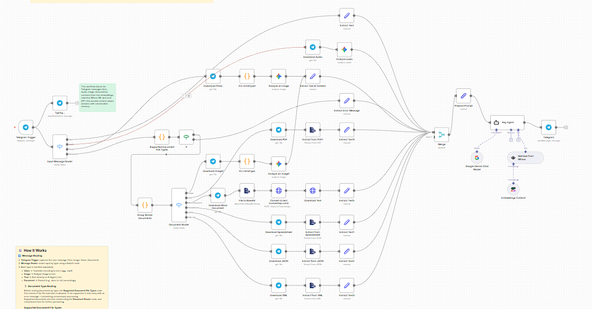
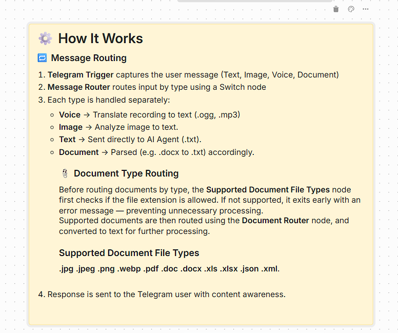
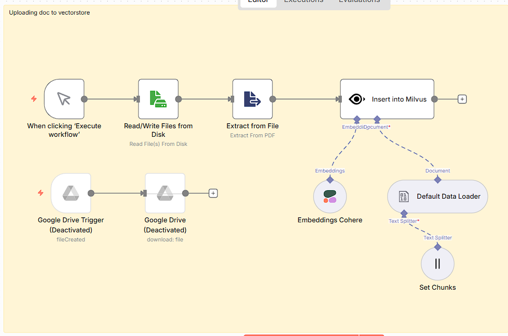
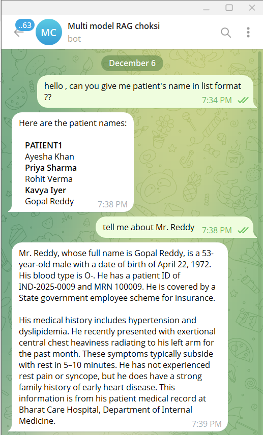
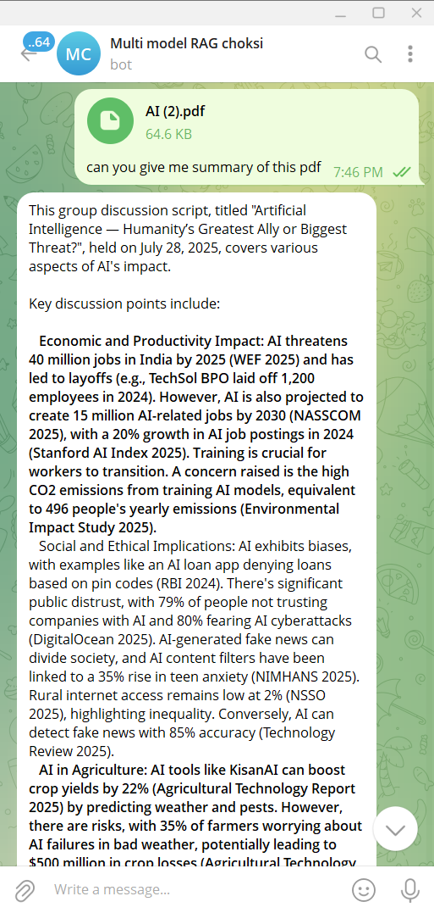

# Multi-Modal RAG Agent

The Multi-Modal RAG Agent is an intelligent chatbot system built using n8n workflow automation that handles multi-modal inputs from Telegram. It processes text, audio, images, and documents by converting them into embeddings, storing them in a vector database, and providing context-aware responses using advanced language models.

This project leverages Retrieval-Augmented Generation (RAG) techniques to enhance AI responses with relevant information retrieved from a knowledge base. The system maintains conversation memory for coherent interactions and supports various document formats for knowledge ingestion.

The agent is designed to be deployed easily using Docker, with webhook support via ngrok for external integrations, making it suitable for real-time conversational AI applications.

## Features

- **Multi-Modal Input Handling**: Supports text, audio, images, and documents from Telegram messages
- **Vector Database Integration**: Uses Milvus for efficient similarity search and retrieval
- **Advanced Embeddings**: Employs Cohere's multilingual embeddings for accurate semantic understanding
- **Conversational Memory**: Maintains context across interactions for natural conversations
- **Document Processing**: Automatically extracts and chunks content from PDFs and other files
- **Real-time Responses**: Provides instant replies via Telegram bot interface
- **Scalable Architecture**: Built on n8n's workflow engine for easy customization and extension
- **Webhook Support**: Integrated with ngrok for external API access

## Visual Overview & Demo

### End-to-End Workflow

<p align="center">
  
</p>

### How It Works (High-Level)

<p align="center">
  
</p>

### Manual Data Upload to Milvus

<p align="center">
  
</p>

### Telegram Chat Experience

<p align="center">
  
  
</p>

### Live Demo (YouTube)

<p align="center">
  <a href="https://youtu.be/9IqJ4VvRxxE" target="_blank">
    
  </a>
</p>

<p align="center">
  ▶️ <a href="https://youtu.be/9IqJ4VvRxxE" target="_blank">Watch the full demo on YouTube</a>
</p>

## Telegram ChatHistory :

[View Chat History](assets/message.html)

## Architecture

The system consists of several key components:

1. **Telegram Integration**: Receives messages and media from users via Telegram Bot API
2. **Data Processing Pipeline**: Extracts text from various formats (PDF, audio transcription, image OCR)
3. **Embedding Generation**: Converts processed content into vector embeddings using Cohere
4. **Vector Storage**: Stores embeddings in Milvus vector database for fast retrieval
5. **Retrieval System**: Performs similarity search to find relevant context for user queries
6. **Language Model**: Uses GPT-4o-mini to generate responses based on retrieved information
7. **Response Delivery**: Sends formatted replies back through Telegram

The workflow is orchestrated through n8n, providing a visual interface for monitoring and modifying the agent's behavior.

## Use Cases

- **Customer Support**: Provide instant, knowledgeable responses based on company documentation
- **Educational Assistant**: Answer questions using uploaded textbooks, research papers, or course materials
- **Research Helper**: Retrieve and summarize information from scientific documents
- **Personal Knowledge Base**: Build a searchable database of personal notes, articles, and media
- **Content Creation**: Generate responses informed by reference materials and style guides
- **Multilingual Support**: Handle queries in multiple languages with multilingual embeddings

## Real-Life Scenarios

### Customer Support Bot
A company deploys the agent as a Telegram bot for their customer service. Customers can send photos of products, voice messages describing issues, or text queries. The bot searches through product manuals, FAQs, and troubleshooting guides stored in the vector database to provide accurate, context-specific answers. For example, a customer sends a photo of a broken device, and the bot identifies the model and suggests repair steps based on the manual.

### Educational Assistant
A teacher uploads course materials, textbooks, and research papers to the knowledge base. Students can ask questions via Telegram, such as "Explain quantum entanglement" while attaching a diagram. The agent retrieves relevant sections from the documents and provides explanations with citations, helping students learn interactively without the teacher being available 24/7.

### Personal Research Assistant
A researcher builds a personal knowledge base with scientific papers, notes, and articles. When working on a new paper, they can send voice memos or text queries like "Find studies on climate change impacts in 2023." The agent searches the vectorized documents and summarizes findings, suggesting related papers and key insights.

### Content Creation Helper
A content creator maintains a database of style guides, brand assets, and reference materials. When brainstorming ideas, they send sketches or voice ideas to the bot. It retrieves similar past content and generates new ideas informed by the brand guidelines, ensuring consistency across marketing materials.

### Multilingual Customer Service
A global company uses the agent for international support. Customers in different countries send messages in their native languages. The multilingual embeddings allow the bot to understand queries in Spanish, French, or Mandarin, retrieve information from localized documentation, and respond appropriately, improving accessibility.

## Prerequisites

- Docker installed on your system
- Telegram Bot Token (obtain from @BotFather on Telegram)
- API keys for:
  - Cohere (for embeddings)
  - OpenAI (for GPT-4o-mini)
  - Milvus (vector database access)

## Setup

1. Clone this repository and navigate to the project directory
2. Configure your API credentials in n8n after setup
3. Start the n8n service:
   ```
   docker-compose up -d
   ```
4. Access n8n at http://localhost:5678
5. Import the `Multi_Modal.json` workflow
6. Configure the Telegram trigger with your bot token
7. Set up credentials for Cohere, OpenAI, and Milvus
8. Activate the workflow

## Configuration

- The n8n data is persisted in a Docker volume
- Webhook URL is configured for ngrok tunneling
- Timezone is set to America/New_York (adjust in docker-compose.yml if needed)
- Document storage is mounted from the local workspace directory

## Usage

1. Send messages, images, audio, or documents to your Telegram bot
2. The agent will process the input and provide relevant responses
3. Upload documents to the `/workspace` directory to expand the knowledge base
4. Use the manual trigger in n8n to process specific documents

## Stopping the Service

```
docker-compose down
```

## Updating

```
docker-compose pull
docker-compose up -d
```